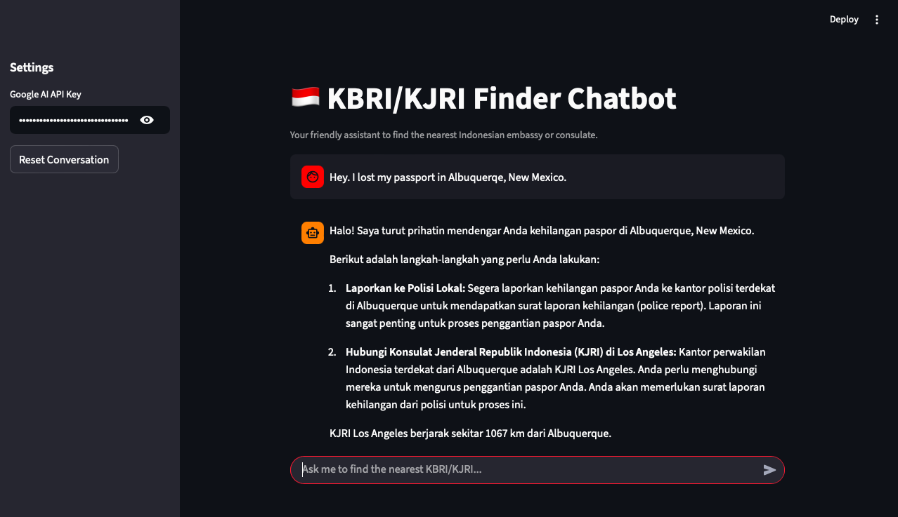

## KBRI/KJRI Finder Chatbot

This is an AI-powered chatbot to help Indonesians abroad find the nearest Indonesian embassy (KBRI) or consulate (KJRI).

### Screenshot



## Features Highlight
- 🌍 Find nearest KBRI/KJRI from any location
- 📍 Geolocation calculation using Haversine formula
- 🤖 Natural language understanding powered by Gemini AI
- 💬 Friendly responses in Indonesian
- 📊 Database of 100+ Indonesian representative offices worldwide

### Prerequisites

Ensure you have Python installed. It is recommended to use `miniconda` or `conda` for environment management.

### Installation

1.  **Create a Virtual Environment**

    It is recommended to create a virtual environment to run this project. You can use `conda` or `venv`.

    Using `venv` (as was done in this project):
    ```bash
    python3 -m venv chatbot-env
    source chatbot-env/bin/activate
    ```

2.  **Install Requirements**

    Navigate to the project directory and install the necessary packages:

    ```bash
    pip install -r requirements.txt
    ```

3.  **Run the Streamlit Application**

    ```bash
    streamlit run streamlit_chat_app.py
    ```

    The application will open in your web browser.

### Running with Docker (Optional)

1.  **Build the Docker Image**

    Navigate to the project directory and build the Docker image:

    ```bash
    docker build -t chatbot-kbri-demo .
    ```

2.  **Run the Docker Container**

    Run the Docker container, mapping port 8501:

    ```bash
    docker run -p 8501:8501 chatbot-kbri-demo
    ```

    The application will be accessible in your web browser at `http://localhost:8501`.

## Code Structure

- `streamlit_chat_app.py`: The main Streamlit application file, containing the chatbot UI and logic for finding the nearest KBRI/KJRI.
- `kbri_kjri_locations.csv`: A list of KBRI/KJRI locations.
- `world_cities.csv`: A dataset of world cities with their coordinates.
- `kbri_kjri_locations_with_coordinates.csv`: A combined dataset of KBRI/KJRI locations with their coordinates.
- `requirements.txt`: Lists all Python dependencies required for the project.
