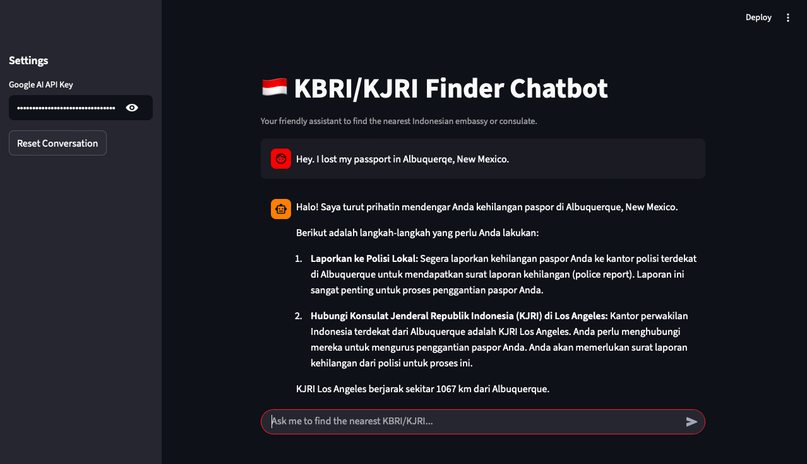

# Chatbot Pencari KBRI/KJRI

Proyek ini adalah sebuah chatbot berbasis AI yang dibuat untuk membantu warga negara Indonesia di luar negeri dalam menemukan kantor kedutaan (KBRI) atau konsulat (KJRI) terdekat.


*Tampilan antarmuka chatbot yang sedang digunakan untuk mencari KJRI terdekat dari New Mexico.*

## Fitur Utama
- **Pencarian Global**: Menemukan KBRI/KJRI terdekat dari lokasi manapun di seluruh dunia.
- **Perhitungan Jarak**: Menggunakan formula Haversine untuk kalkulasi geolokasi yang akurat.
- **Pemahaman Bahasa Alami**: Didukung oleh Gemini AI untuk memproses input pengguna.
- **Respons Interaktif**: Memberikan jawaban dalam bahasa Indonesia yang natural.
- **Basis Data Lengkap**: Memuat lebih dari 100 lokasi perwakilan Indonesia di berbagai negara.

## Instalasi & Penggunaan

### Prasyarat
Proyek ini memerlukan Python. Disarankan untuk menggunakan `miniconda` atau `conda` untuk manajemen environment.

### Langkah-langkah Instalasi
1.  **Membuat Lingkungan Virtual**

    Sebaiknya proyek dijalankan dalam sebuah lingkungan virtual. Proyek ini sendiri dikembangkan menggunakan `venv`.
    ```bash
    python3 -m venv chatbot-env
    source chatbot-env/bin/activate
    ```

2.  **Instalasi Dependensi**

    Masuk ke direktori proyek dan jalankan perintah berikut:
    ```bash
    pip install -r requirements.txt
    ```

3.  **Menjalankan Aplikasi**

    Untuk menjalankan aplikasi Streamlit, gunakan perintah:
    ```bash
    streamlit run streamlit_chat_app.py
    ```
    Aplikasi akan otomatis terbuka pada peramban web.

### Opsi Menjalankan dengan Docker

1.  **Build Image Docker**

    Dari direktori proyek, build image Docker dengan:
    ```bash
    docker build -t chatbot-kbri-demo .
    ```

2.  **Jalankan Kontainer Docker**

    Jalankan kontainer dengan memetakan port 8501:
    ```bash
    docker run -p 8501:8501 chatbot-kbri-demo
    ```
    Aplikasi akan bisa diakses pada `http://localhost:8501`.

## Struktur Kode
- `streamlit_chat_app.py`: File utama aplikasi Streamlit, berisi logika UI dan pencarian KBRI/KJRI.
- `kbri_kjri_locations.csv`: Daftar lokasi KBRI/KJRI.
- `world_cities.csv`: Dataset kota-kota dunia beserta koordinatnya.
- `kbri_kjri_locations_with_coordinates.csv`: Gabungan data lokasi KBRI/KJRI dengan koordinat.
- `requirements.txt`: Daftar semua dependensi Python yang dibutuhkan.
